# How a robot arm learns to move safely on a floating spacecraft

*A guided tour of **spacearm**: what each model does, why it is built that way, how it was trained, and how well every part works.*

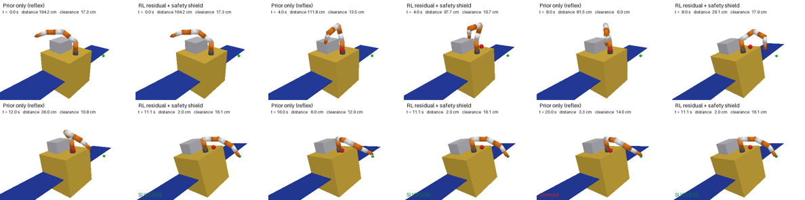
*One episode, two controllers. A ball appears in the arm's way. The classical reflex (left) is held up beside it and runs out of time 3.3 cm short. The learned controller with a safety shield (right) goes around and arrives at 11.1 s. Video: [`reports/demo.mp4`](../reports/demo.mp4).*

---

## 1. The problem

A 7-joint robot arm sits on top of a spacecraft that floats freely in orbit. It must bring its tool tip to a target point without ever touching the spacecraft, itself, or a surprise obstacle, even while its sensors and motors misbehave. Two things make this hard.

* **Geometry.** Seven joints give infinitely many ways to put the tip on the same point, and many of them sweep the arm through the spacecraft.
* **Physics.** Nothing holds the spacecraft still. When the arm swings one way, the spacecraft turns the other way (Fig. 1), so a target fixed in space moves relative to the spacecraft while the arm reaches for it.

The project therefore works on two levels.

* **Level 1** plans once, in the spacecraft's own frame. There a collision depends only on the 7 joint angles, so the geometry can be solved exactly, without physics.
* **Level 2** flies the arm closed-loop, 10 times a second. It watches where the target really is and copes with surprises.

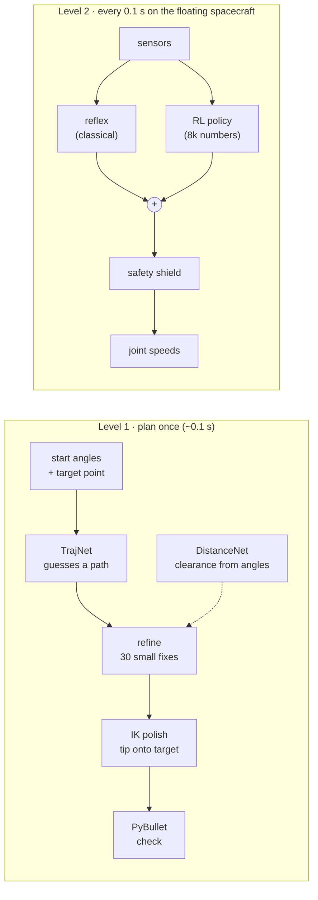

## 2. The world: a sandbox with exact answers

Everything is simulated in PyBullet from one parameter file, `configs/default.yaml`.

* **The spacecraft:** a 1 m, 150 kg box (the "bus"), two 0.8 × 1.6 m solar panels, a 40 × 50 × 30 cm payload box on the top deck, and a short pedestal. 194 kg in all.
* **The arm:** 18 kg, with 7 capsule-shaped links. Its joints alternate twist and bend (z-y-z-y-z-y-z), like a shoulder, elbow and wrist. It reaches about 1.1 m from the shoulder at up to 0.5 rad/s per joint.

**Physics without friction.** With zero gravity and damping, momentum is conserved: moving one joint for 2 s turns the spacecraft 5.9° the other way, both stop together, and the centre of mass moves less than 0.05 mm (Fig. 1). Obstacles are "ghosts" that PyBullet measures but that never push anything, so no collision is hidden by a bounce.

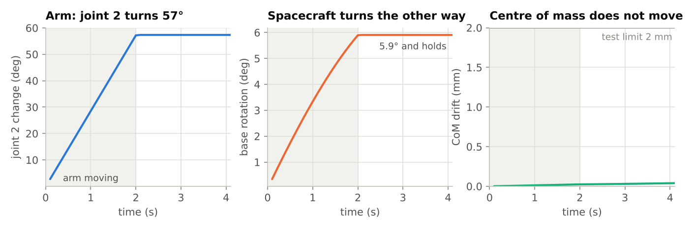
*Fig. 1. Momentum is conserved: the arm turns, the spacecraft counter-rotates, and the centre of mass stays put.*

**Two distances define "safe".**
* **`d_body`** is the shortest gap between any arm link and any spacecraft part: the minimum over 30 link pairs.
* **`d_self`** is the shortest gap between two arm links: the minimum over 10 pairs. Neighbouring links, and links that can never touch, are skipped.

Negative means overlap. A collision happens as soon as *any* pair touches, so one number each is enough.

**Forward kinematics (FK), rewritten in PyTorch.** FK is fixed geometry, not learned: 7 angles in, link and tip positions out. PyBullet computes it but cannot say *which way to change the angles* to move the tip; the same formula in PyTorch can, because PyTorch differentiates automatically. This lets the networks learn *through* the geometry. It matches PyBullet to 0.0001 mm.

## 3. The dataset: 200,000 labelled poses

`scripts/gen_data.py` samples random poses and asks PyBullet for the true `d_body`, `d_self` and tip position of each. Random poses rarely land near a surface, where accuracy matters most, so a quarter of the samples are near-contact poses nudged to within 5 cm of touching. The near-surface share rises from 8 % to 31 % (Fig. 2). Generation takes under a minute and is deterministic.

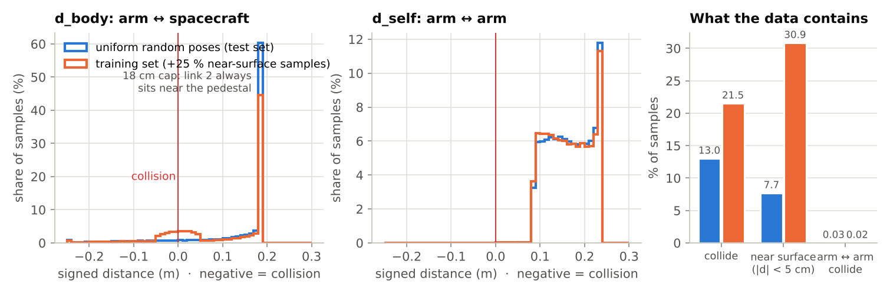
*Fig. 2. The training set (orange) is enriched near the collision surface.*

Two quirks matter later. Arm-to-arm collisions are almost absent (49 of 200,000 samples). And `d_body` never exceeds 18 cm, because link 2 always sits near the pedestal.

## 4. DistanceNet: clearance at a glance

**Job:** from the 7 joint angles, predict `d_body` and `d_self` instantly, plus *which way to move to gain clearance*. The planner and the safety shield both need that direction.

| | |
|---|---|
| Input | the 7 angles as `[sin q, cos q]` (14 numbers); +179° and −179° are almost the same pose, and sin/cos says so |
| Output | `d_body`, `d_self` (m); "clearance" = their smooth minimum, never above the smaller one |
| Target (truth) | PyBullet's distances for that pose, clipped to −5…+30 cm |
| Network | 14 → 256 → 256 → 256 → 2, SiLU activations, 135,938 parameters |
| Loss | Huber (squared below 2 cm, linear above); errors within 5 cm of contact weighted × 10 |
| Training | 60 epochs, AdamW, 49 s on 4 CPU cores |

**Two design choices.**
* **Huber loss:** precise near the truth (squared error), while a few deep-collision outliers can't dominate (linear error).
* **SiLU activation:** it is smooth, so the "move this way" direction changes gradually instead of jumping as it would with ReLU.

| Result on 20,000 unseen poses | Target | Got |
|---|---|---|
| mean error | ≤ 1.0 cm | **0.68 cm** |
| mean error within 10 cm of contact | ≤ 2.0 cm | **1.22 cm** |
| "colliding or free" correct | ≥ 97 % | **98.3 %** |
| says ≥ 3 cm free while colliding | ≤ 0.5 % | **0.12 %** |

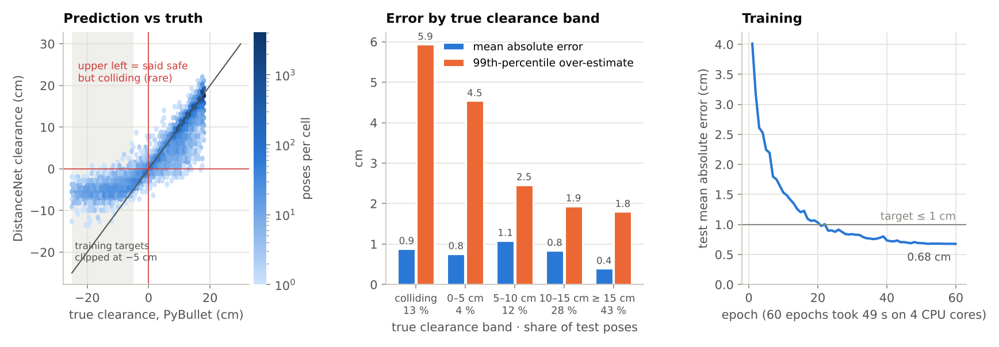
*Fig. 3. Prediction vs truth, error by distance band, and training. For safety the key number is the over-estimate near contact: 4.5 cm at the 99th percentile.*

Fig. 4 shows what the network has learned: a smooth map of safe and unsafe poses. Along the boundary its errors are mostly on the cautious side (blue).

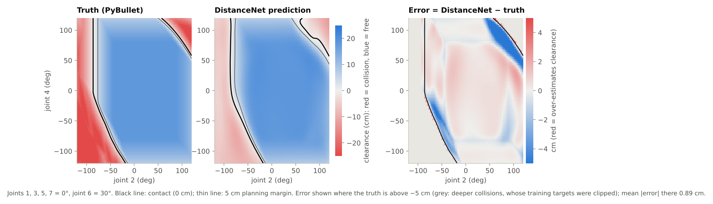
*Fig. 4. Clearance over two joints, the other five fixed. The network reproduces the collision boundary from the angles alone.*

**Caveat:** rarely, the network is confidently wrong. Of the poses it rates at least 5 cm clear, 0.05 % actually collide; the worst case is predicted +9 cm, truly −4.4 cm. This is why the shield (Section 9) keeps a 6 cm margin and is a filter, not a proof.

## 5. TrajNet: guessing a whole path in one go

**Job:** from the current joint angles and a target *point*, propose a smooth, collision-free motion that ends with the tip on the target. (The start angles already fix the starting tip position, through FK.)

**A path as 8 control points.** The network outputs a Bézier curve, defined by 8 "control poses" P0…P7, each a full set of 7 angles.
* **Start and goal:** P0 = P1 = the start, and P6 = P7 = the goal pose, which the network chooses. The doubled points make the arm start and stop at rest.
* **The middle points P2–P5** bend the path. Each is output as an **offset from its own spot on the straight line** between start and goal (2/7 … 5/7 of the way). Each output slot therefore has a fixed role, and zero offsets give a straight path.

**Each pose on the path is a weighted average of all 8 control poses.** The weights come from a fixed formula, `C(7,k)·s^k·(1−s)^(7−k)`, that depends only on how far along the path you are (`s`); nothing about them is learned. As `s` goes from 0 to 1, the weight slides from P0 to P7 (Fig. 5). So:
* the arm passes through only the start and the goal; the middle points pull the path but are never reached;
* the path is smooth and can be sampled at any density (16 frames for scoring, 100 for checking);
* joint limits hold automatically: every control angle is squashed into its joint's range with `tanh`, and an average of in-range angles stays in range.

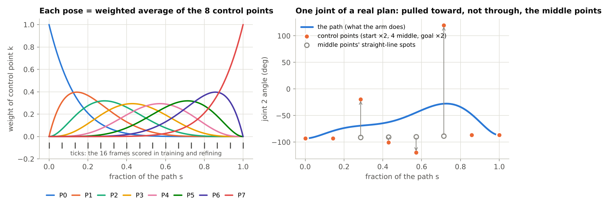
*Fig. 5. Left: the fixed weights; the ticks are the 16 scoring frames. Right: one joint of a real plan. The middle points (orange) are pushed far from their straight-line spots (hollow), and the path (blue) is pulled toward them, not through them.*

**Network:** 17 inputs (start angles as sin/cos, and the target x, y, z) → 512 → 512 → 512 → 35 outputs (goal pose + 4 middle offsets). SiLU, 552,483 parameters. The last layer starts at zero, so an untrained network proposes a plain straight path rather than noise.

**Training without answers.** A 7-joint arm can reach a point in infinitely many ways, so there is no single right path to copy, and averaging several right answers gives a wrong one. Instead every proposed path is **scored**, and the network learns to lower the score:

```
score = 100  × (tip-to-target distance)²                  reach       (exact FK on the goal pose)
      + 1000 × mean over 16 frames of (5 cm − clearance)²  only where clearance < 5 cm (DistanceNet)
      + 0.1  × sum of squared joint steps between frames    smoothness
```

Each training query pairs two random collision-free poses: the first is the start, the second's tip position the target (always reachable). 10,000 steps × 256 queries took 3 min 15 s. Alone, the network puts the tip within 2 cm on 85 % of unseen queries (Fig. 6).

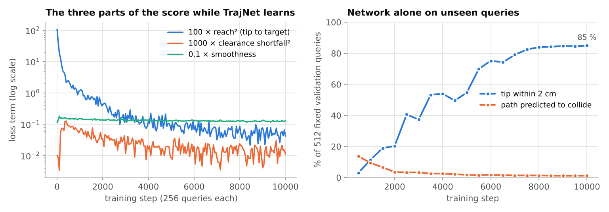
*Fig. 6. The three score terms during training (left) and network-only accuracy on 512 unseen queries (right).*

## 6. The planner: guess, refine, polish, check

The guess is fast but rough; three exact steps finish it (`src/spacearm/planner.py`).

1. **Refine (test-time optimisation).** TrajNet is frozen. The 35 numbers of *this* path are adjusted directly, 30 times, on the same score.
   * Each round, PyTorch backpropagates through *35 numbers → control points → 16 frames → DistanceNet and FK → score*, giving the downhill direction for every number.
   * The Adam optimiser moves each number about 0.05.
   * It is like training a tiny model whose only weights are this path's 35 numbers, discarded afterwards.
2. **IK polish.** Ten rounds of damped-least-squares inverse kinematics move only the goal pose: `Δq = Jᵀ(JJᵀ + 0.01²I)⁻¹ · (target − tip)`. This is the smallest joint change that closes the tip-to-target gap; the damping prevents huge jumps near full stretch.
3. **Check.** PyBullet measures the true clearance at 100 points along the path. Success = no contact, tip within 2 cm, joints within limits. On failure, the planner re-plans once with 100 refinement rounds.

What each stage adds, on the same 200 random and 100 hard queries as v1.0. "Hard" means the classical baseline collides, which happens on 4.6 % of random queries.

| Stage | Random: success / collisions | Hard: success / collisions | Median reach error |
|---|---|---|---|
| Baseline: PyBullet IK + straight line | 92 % / 3.5 % | **0 %** / 100 % | 0.14 cm |
| TrajNet alone | 85 % / 1.5 % | 66 % / 6 % | 1.02 cm |
| TrajNet + refine | 56 % / 0.5 % | 54 % / 1 % | 1.85 cm |
| TrajNet + IK polish | 98 % / 1.5 % | 93 % / 7 % | < 0.01 cm |
| TrajNet + refine + polish | 99.5 % / 0.5 % | **100 %** / 0 % | < 0.01 cm |
| **Full planner** (+ check, retry) | **100 %** / 0 % | **100 %** / 0 % | < 0.01 cm |

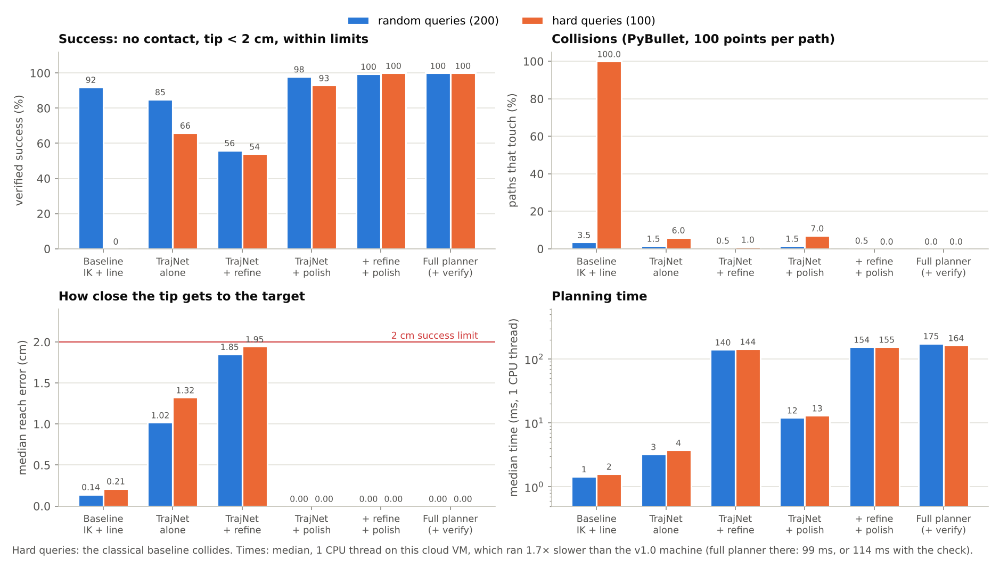
*Fig. 7. What each stage adds. The full planner takes about 0.1 s on one CPU thread (v1.0 machine; this study's VM ran 1.7× slower).*

**A surprise (new in v1.1): refining alone makes things worse.** It removes collisions, but the smoothness term pulls the goal back toward the start, so the tip drifts 1–2 cm off and success falls from 85 % to 56 %. Polishing alone fixes the reach but leaves 7 % of hard paths colliding. Together they reach 100 %: **refine buys clearance, polish buys precision.** In the hard query of Fig. 8, the baseline's arm link 5 sweeps through the payload box; TrajNet's guess ends with link 4 inside it, 13.6 cm off target; refining lifts the path clear but leaves the tip 2.6 cm off; polishing lands it.

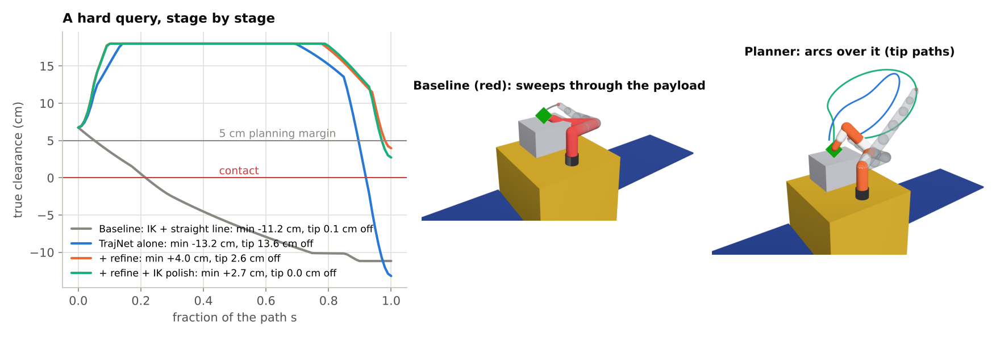
*Fig. 8. One hard query: true clearance along each stage's path, with 3D renders.*

## 7. Why planning is not enough

Played *open-loop* (without feedback) on the floating spacecraft, verified plans are followed almost perfectly in the spacecraft's frame, but the spacecraft turns about 6° in reaction. The tip ends a median **17 cm** (up to 33 cm) from a target fixed in space (Fig. 9): Level 1 is exact about geometry but blind to physics.

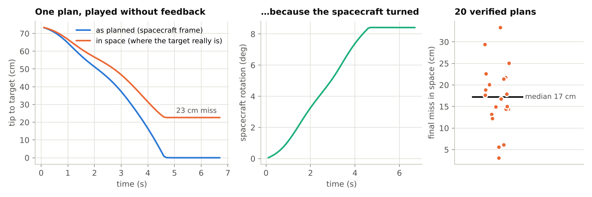
*Fig. 9. A perfect plan, played without feedback, misses because the spacecraft turns.*

## 8. Level 2: flying the arm closed-loop

**One episode** (`src/spacearm/envs/space_reach_env.py`). The arm starts at a random safe pose. The target is a random point fixed in space, within 85 % of the arm's reach. Every 0.1 s, for up to 20 s, the controller reads the sensors and commands 7 joint speeds while the spacecraft floats.
* **Success:** the tip is within 2 cm of the target and almost still.
* **Failure:** a collision, or 20 s without success.

**Surprises** are scaled by a difficulty `d` from 0 to 1:

| Surprise | At full difficulty (d = 1) |
|---|---|
| Ball obstacle | 80 % of episodes; radius 5–12 cm; appears 1–5 s in, between the hand and the target at that moment; half drift at up to 3 cm/s |
| Encoder bias | each joint reads up to ±2° wrong |
| Weak motors | each joint delivers 70–100 % of the commanded speed |
| Encoder slip | 30 % of episodes: one joint's reading jumps 3° |
| Sensor noise | encoders 0.1°, camera 5 mm, gyro 0.002 rad/s |

**The reflex (classical prior),** `src/spacearm/control.py`, steers the tip straight at the target (as seen by the camera), uses the spare 7th joint to lean away from the spacecraft without moving the hand, and pushes away from a ball closer than 15 cm. It is reliable, but when the ball sits on the straight line to the target it **stalls in front of it**.

**The RL policy adds a correction:** `command = reflex + 0.5 × fade × correction`. It has half authority and fades out within 10 cm of the target, so the reflex always does the precise final approach.

| | Actor (the policy) | Two critics (training only) |
|---|---|---|
| Input | 56 numbers a real robot could measure: joint angles and speeds, camera vector to the target, gyro, the ball as seen, clearances with their "move this way" directions, the reflex's command | the same + 34 simulator-only truths (true angles, sensor errors, true clearances, …) |
| Output | 7 joint-speed corrections | expected future reward / future near-misses |
| Network | 56 → 64 → 64 → 7, 8,270 parameters | 90 → 256 → 256 → 1 each, 89,345 parameters |

**Reward:** progress toward the target, +5 on success, and small penalties for jerky or large corrections. **Cost:** 1 for every step in which anything is closer than 2 cm (a near-miss).

**PPO-Lagrangian.** PPO nudges the policy toward actions that turned out better than the critics expected, never too far at once. The Lagrangian part learns a safety weight λ: if episodes average more than one near-miss step, λ rises and near-misses count more. Training ran 3 million steps (surprises ramping from none to full over the first half) in 1 h 45 min on 4 CPU cores.

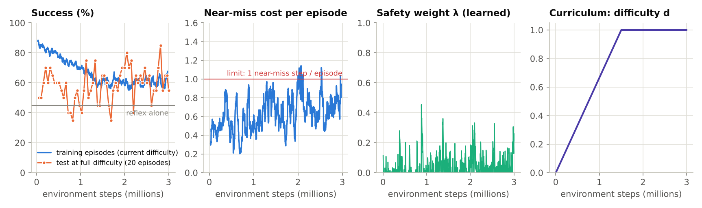
*Fig. 10. Training-episode success falls as the curriculum makes them harder; full-difficulty test success stays above the reflex alone (grey line). λ never exceeds 0.45: the safety constraint rarely bound, so RL learned to succeed rather than to be careful.*

## 9. The safety shield: a last check on every command

Learned constraints are soft, so every command passes a model-based filter (`src/spacearm/safety/shield.py`).
* **Predict:** "where would this command put the arm in 0.2 s?", trying the full command, then ½ and ¼ of it.
* **Accept** the largest version that keeps the predicted DistanceNet clearance above **6 cm** and the predicted clearance to the ball above 5 cm.
* **Escape:** if none does, it moves the arm in the direction that increases clearance, or stops it.

It intervenes on 9–15 % of steps and costs 0.2 ms (3 ms when escaping).

The margin was chosen with data (Fig. 11). At 5 cm, RL + shield grazed the spacecraft in 2 of the 40 acceptance-test episodes: after an encoder slip, the clearance estimate was about 5.5 cm too optimistic. At 6 cm it had none, at a cost of about 2 points of success.

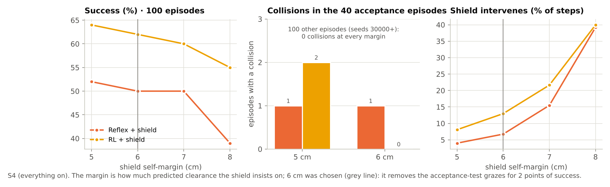
*Fig. 11. The margin trades success for safety.*

## 10. Results

**Main table:** 100 identical episodes per cell, on seeds never used for training or model selection. Each cell is success / collisions.

| Scenario | Reflex | Reflex + shield | RL | **RL + shield** |
|---|---|---|---|---|
| S1 nominal (no surprises) | 88 % / 5 % | 83 % / 0 % | 94 % / 2 % | **89 % / 0 %** |
| S2 obstacles only | 58 % / 6 % | 53 % / 1 % | 71 % / 4 % | **68 % / 0 %** |
| S3 faults + noise only | 85 % / 3 % | 77 % / 0 % | 92 % / 3 % | **87 % / 0 %** |
| S4 everything (d = 1) | 45 % / 7 % | 41 % / 1 % | 61 % / 4 % | **58 % / 0 %** |

Without its push-away behaviour, the reflex collides in about 60 % of obstacle episodes.

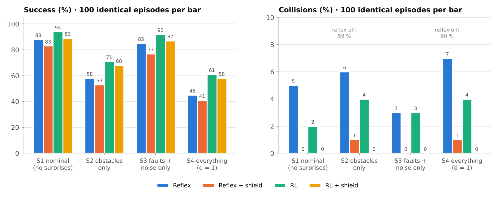
*Fig. 12. RL adds 6–16 points of success and reaches targets about 30 % faster; the shield removes all of RL's collisions (13 → 0) at a cost of 3–5 points.*

In the demo episode (Fig. 13), the reflex is held up beside the ball for about 3 s and runs out of time; RL + shield keeps about 6 cm from the ball and arrives at 11 s.

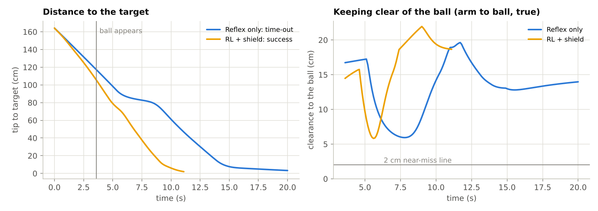
*Fig. 13. The demo episode. Each controller's ball appears between its own hand and the target, so it is always in the way.*

**Variants (new in v1.1): which surprise hurts?** 17 variants × 4 controllers × the same 100 fresh episodes (seeds 40000+), from `scripts/eval_level2_variants.py`.

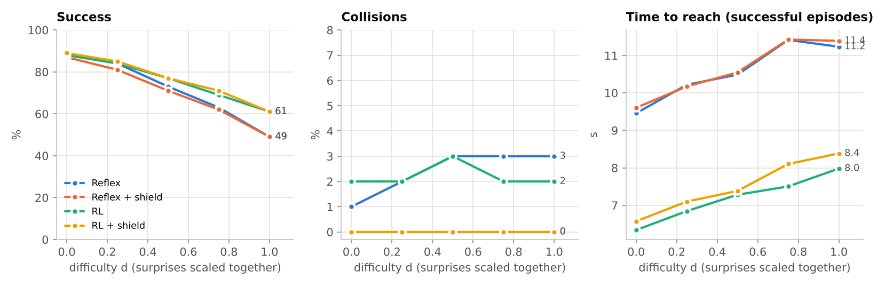
*Fig. 14. Everything scaled together. RL's advantage grows with difficulty: none at d = 0, +12 points at d = 1.*

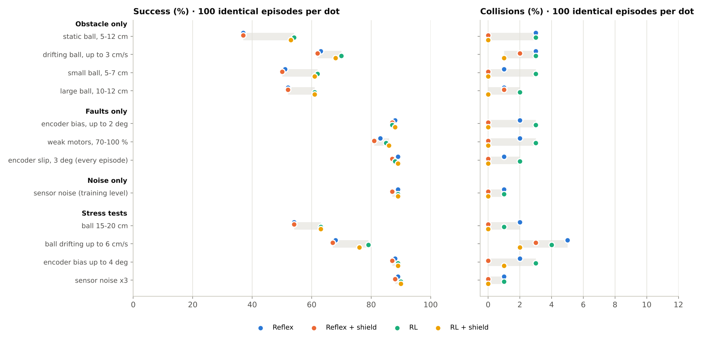
*Fig. 15. One surprise at a time (dots offset slightly so none hides another).*

| Variant | Reflex | Reflex + shield | RL | RL + shield |
|---|---|---|---|---|
| d = 0 / 0.25 / 0.5 / 0.75 / 1 (success) | 89 / 84 / 73 / 63 / 49 % | 87 / 81 / 71 / 62 / 49 % | 88 / 84 / 77 / 69 / 61 % | 89 / 85 / 77 / 71 / 61 % |
| static ball, 5–12 cm | 37 % / 3 % | 37 % / 0 % | 54 % / 3 % | 53 % / 0 % |
| drifting ball, ≤ 3 cm/s | 63 % / 3 % | 62 % / 2 % | 70 % / 3 % | 68 % / **1 %** |
| small ball, 5–7 cm | 51 % / 1 % | 50 % / 0 % | 62 % / 3 % | 61 % / 0 % |
| large ball, 10–12 cm | 52 % / 1 % | 52 % / 1 % | 61 % / 2 % | 61 % / 0 % |
| encoder bias ≤ 2° | 88 % / 2 % | 87 % / 0 % | 87 % / 3 % | 88 % / 0 % |
| weak motors 70–100 % | 83 % / 2 % | 81 % / 0 % | 85 % / 3 % | 86 % / 0 % |
| encoder slip 3° (every episode) | 89 % / 1 % | 87 % / 0 % | 88 % / 2 % | 89 % / 0 % |
| sensor noise (training level) | 89 % / 1 % | 87 % / 0 % | 89 % / 1 % | 89 % / 0 % |
| *stress:* ball 15–20 cm | 54 % / 2 % | 54 % / 0 % | 63 % / 1 % | 63 % / 0 % |
| *stress:* ball drifting ≤ 6 cm/s | 68 % / 5 % | 67 % / 3 % | 79 % / 4 % | 76 % / **2 %** |
| *stress:* encoder bias ≤ 4° | 88 % / 2 % | 87 % / 0 % | 89 % / 3 % | 89 % / **1 %** |
| *stress:* sensor noise × 3 | 89 % / 1 % | 88 % / 0 % | 90 % / 1 % | 90 % / 0 % |

*Success / collisions. In the difficulty sweep, collisions are 1–3 % without the shield and 0 % with it. Full tables: [`reports/level2/variants.md`](../reports/level2/variants.md).*

**What the variants teach**
1. **Obstacles are the whole story.** Faults or noise alone barely matter (81–89 % success for every controller): steering on the camera's tip-to-target vector corrects a biased encoder.
2. **A static ball is the hardest case** (37 % for the reflex): it blocks the straight line for good, the reflex's stall. RL gains most here (+17 points).
3. **RL helps where the reflex is weak:** nothing on faults or noise, +7 to +17 points with obstacles.
4. **The shield is not airtight against moving balls.** It predicts the *arm* 0.2 s ahead but not the *ball*: drifting balls still cause 1–2 % collisions (2–3 % at twice the trained speed), and a 4° bias, beyond the margin's design point, let one graze through.
5. **Beyond training, it degrades gracefully:** RL stays ahead with larger or faster balls, and is no worse with 4° bias or triple noise.

**How precise are these numbers?** With 100 episodes, a 50 % rate carries about ±10 points of 95 % uncertainty (±6 at 90 %). Identical episodes make *differences* more reliable, but gaps under about 5 points are noise: RL's 6-point S1 edge (seeds 10000+) is −1 on fresh seeds (the d = 0 row).

**Speed.** Everything fits easily in the 100 ms control period. The actor takes 0.01 ms (NumPy or ONNX), the reflex 0.3 ms, the shield 0.2 ms, and a whole control step including physics 4.5 ms (Fig. 16).

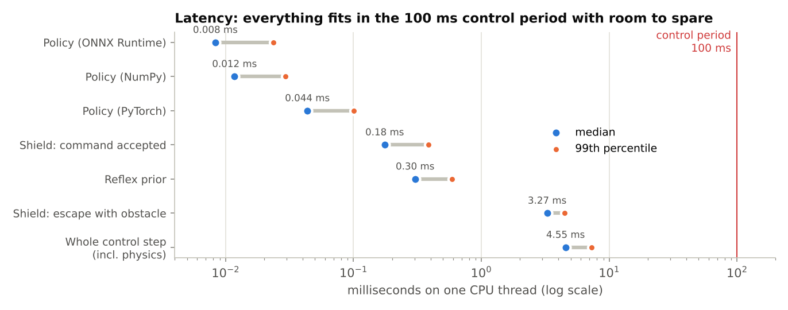
*Fig. 16. Latency on one CPU thread.*

## 11. Try it yourself: the interactive explorer

`pip install gradio plotly`, then `python scripts/gui.py`, opens a local web app (`src/spacearm/gui/`).

* **① Pose & clearance:** 7 joint sliders. Shows the arm, the true `d_body` and `d_self` beside DistanceNet's prediction, and the closest link pairs drawn as segments.
* **② Path planner:** a start pose and a target point. Every stage (baseline, TrajNet, + refine, + polish, full planner) is checked in PyBullet, with clearance-along-path and control-point charts. The default query is the hard one of Fig. 8.
* **③ Mission simulator:** a full Level-2 episode with your choice of controller (or all four side by side), start and target, ball (none, static or drifting; size, timing, speed), encoder bias, motor weakness, encoder slip and sensor noise. Presets cover S1–S4 and a stress test; settings beyond the training range are allowed but flagged. Replay mode reproduces any report episode exactly (seeds 10000–10099).

| Pose & clearance | Path planner |
|---|---|
| 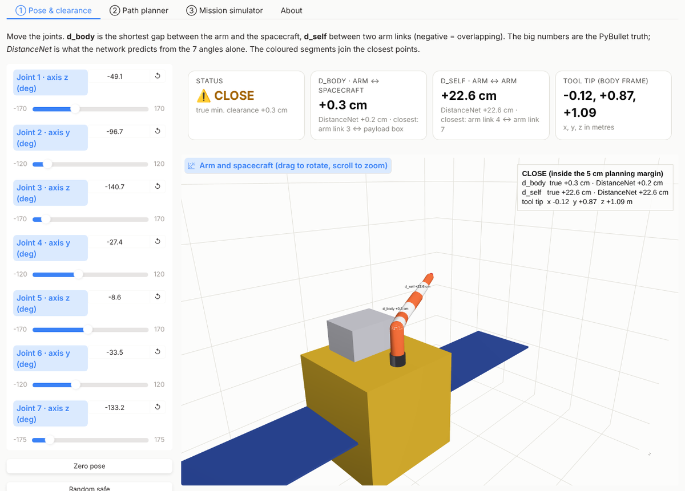 | 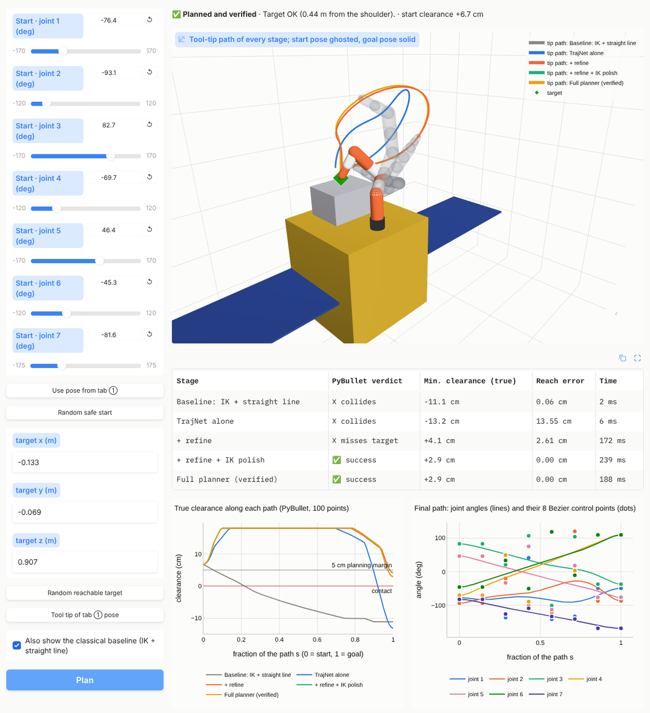 |

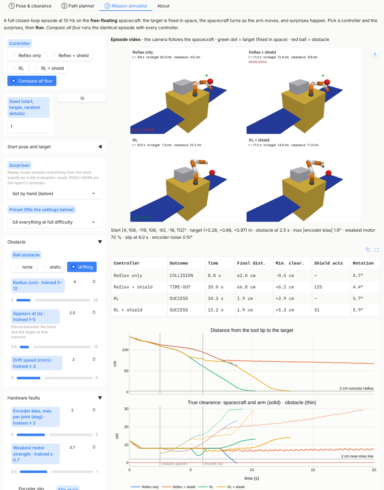
*All four controllers on one episode: the reflex collides; the shield keeps it safe but stuck; RL and RL + shield arrive.*

## 12. Limitations and what to improve next

In order of expected value:
1. **A shield that predicts the ball's motion,** as it already does for the arm's, should close the 1–3 % collision gap with drifting balls.
2. **Re-plan around static obstacles,** the dominant failure (37–54 % success): add the ball's clearance to the Level-1 refine score and let RL track that path, or train RL on more obstacle-heavy episodes.
3. **A DistanceNet that errs on the safe side by design.** An asymmetric loss that penalises over-estimates more, or a learned uncertainty, could shrink the 6 cm margin, and every centimetre of margin costs success.
4. **A safety constraint that binds.** λ stayed below 0.45, so the caution came from the reflex and the shield. A distance-weighted cost or a lower limit would teach RL itself to keep clear.
5. **Data and planner gaps.** Sample near arm-to-arm contact on purpose (only 49 such samples exist), and keep refine from drifting off the target (e.g. polish inside the loop).
6. **The real world.** Flexible panels, fuel slosh, actuator and camera delays and contact are not modelled. The shield is a model-based filter, not a proof.

## 13. Reproduce

```bash
pip install -e .                               # dependencies: environment.yml or cloud/setup.sh
python scripts/gen_data.py                     # data/ (under a minute, deterministic)
python scripts/eval_level1.py                  # Level-1 table        → reports/level1/
python scripts/eval_level1_stages.py           # stage-by-stage table → reports/level1/stages.*
python scripts/eval_level2.py                  # S1–S4 table          → reports/level2/
python scripts/eval_level2_variants.py         # 17 variants (~20 min on 4 cores) → reports/level2/variants*
python scripts/make_writeup_figures.py         # every figure in this document
python scripts/gui.py                          # the interactive explorer
```

Design rationale: [`docs/DESIGN.md`](DESIGN.md) · phase reports and every number: [`reports/`](../reports) · decisions and open issues: [`docs/PROGRESS.md`](PROGRESS.md).
